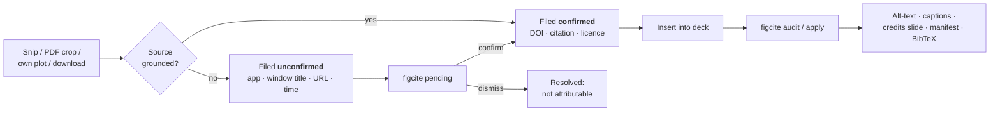
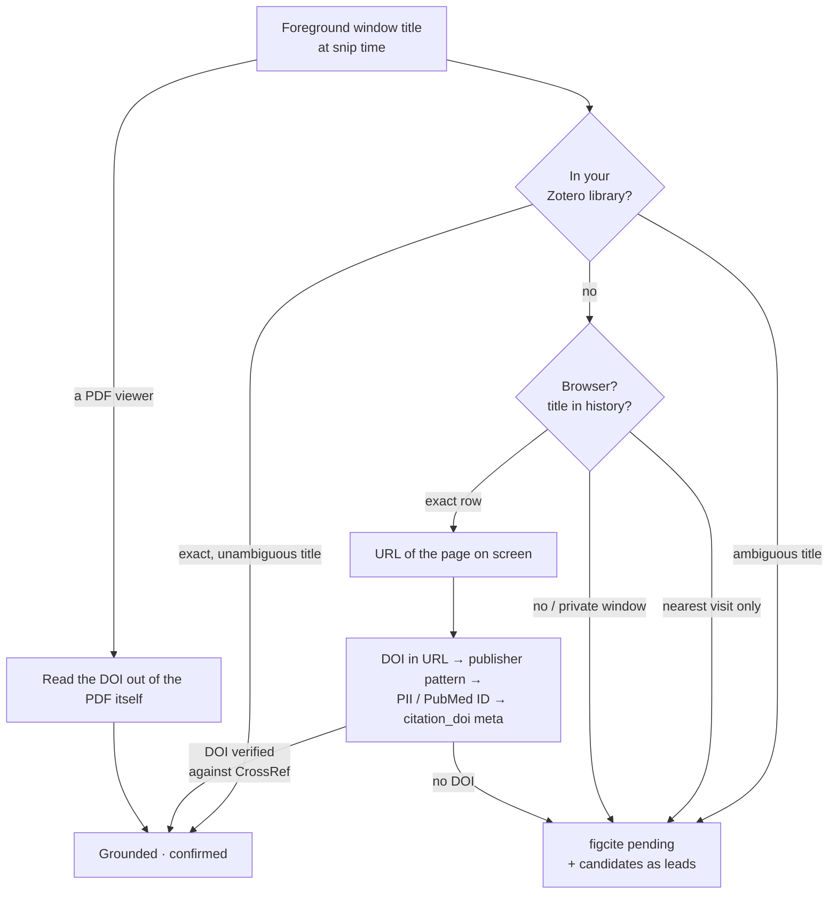

# figcite

Keep the DOI and citation attached to an image from the moment you capture it
through to the slide it lands on — and out the other side as a credits slide,
a bibliography, and a manifest.

**A guessed citation never reaches a slide.** Everything below follows from
that one rule.

```bash
pip install figcite            # add '[match]' to identify cropped figures (pulls opencv)

figcite watch                  # Windows: file every snip you take, grounded when it can be
figcite pending                # what it could NOT ground -- confirm or dismiss each one
figcite audit  deck.pptx       # which pictures in a deck have a source
figcite apply  deck.pptx -o deck.cited.pptx   # alt-text, captions, credits slide, manifest
```



---

**Contents**

1. [How it works](#how-it-works)
2. [Capturing images](#capturing-images)
3. [Resolving what could not be grounded](#resolving-what-could-not-be-grounded)
4. [Where the DOI comes from](#where-the-doi-comes-from)
5. [Into the deck](#into-the-deck)
6. [Reverse lookup: which paper is this figure from?](#reverse-lookup-which-paper-is-this-figure-from)
7. [Bibliography and licensing](#bibliography-and-licensing)
8. [Command reference](#command-reference)
9. [Install, tests, and the push gate](#install-tests-and-the-push-gate)
10. [Known limits](#known-limits)

---

## How it works

Provenance rides along in three places, and they fail differently:

| Layer | Survives | Dies when |
| --- | --- | --- |
| **1. Embedded in the image bytes** (PNG `tEXt`/XMP, JPEG EXIF) | _Insert → Picture_ | clipboard paste, "Compress Pictures" — anything that re-encodes |
| **2. Shape alt-text in the `.pptx`** | edits, save/reopen, export to tagged PDF | someone deletes and re-inserts the picture |
| **3. Central manifest** keyed by sha256 **and** perceptual dhash | everything above failing | the image is heavily cropped or redrawn |

`figcite` writes all three. Matching a slide image back to its source tries
them in that order; a dhash match is reported as fuzzy and treated as
unconfirmed.

### The rule that shapes the design

DOIs read out of the PDF you cropped from are **grounded** and marked
confirmed. DOIs inferred from a window title are **not**, and stay behind
`figcite pending` until you pick one.

This isn't hypothetical caution. Asking CrossRef for the exact title
_"Array programming with NumPy"_ returns a **review of** that paper as the top
hit, not the paper — score 37.2, ahead of everything else. A tool that
auto-accepted the top hit would have put the wrong citation on a slide with
full confidence.
`tests/test_live.py::test_crossref_title_search_is_untrustworthy_by_design`
pins that behaviour so the policy can be revisited if CrossRef ever improves.

---

## Capturing images

Four ways an image arrives. Each one ends with a **tagged file** you insert
into the deck instead of the original.

### 1. A snip or screenshot (Win+Shift+S)

```bash
figcite watch                     # leave running; catches every image you copy
figcite autostart                 # or keep it running across logons
```

A snip from a browser tab whose title is in your history, or from a local
PDF, is grounded and filed automatically — no step. Everything else, including
a browser tab the history cannot place, lands in `figcite pending` (next
section).

### 2. A figure inside a paper PDF

The DOI is read from the PDF itself.

```bash
figcite images paper.pdf --page 3                              # list embedded figures + bboxes
figcite grab   paper.pdf --page 3 --image-index 0 -o fig.png
figcite grab   paper.pdf --page 3 --rect 84,126,505,730 --dpi 300 -o fig.png
figcite grab   paper.pdf --page 3 --rect 0.1,0.1,0.9,0.5 --frac   # fractions of the page
```

### 3. Your own generated plots

Register at the call site, or patch `savefig` once and let ordinary code file
itself. Either way the git commit and working directory are stamped in.

```python
import figcite.mplhook as fc

fc.savefig(fig, "out.png", cite="This work", dataset="rnaseq_v3")

# ...or, once, at the top of the script:
fc.install(dataset="rnaseq_v3")
fig.savefig("panel_a.png")      # now filed, no call-site change
```

### 4. A file you downloaded

```bash
figcite tag downloaded.png --doi 10.1111/mec.12953
figcite tag screenshot.png --url https://example.org/page --cite "Example Org, 2026"
figcite register existing.png --doi 10.1111/mec.12953   # record provenance WITHOUT touching the file
```

---

## Resolving what could not be grounded

Every clipboard capture is filed, whether or not a citation could be
established:

- **Grounded** (a DOI from the page's URL, or from the PDF the snip came from)
  → filed confirmed, with the full citation and license.
- **Everything else** → filed _unconfirmed_, carrying what was actually
  observed: which app was in front, what the window title said, what URL was
  open, and when.

That second case is the point of the design. A screenshot with no resolvable
DOI still knows it came from Firefox showing a particular page at a particular
minute, and an audit reports that instead of "no source recorded". It is a
trail, not a citation, and it is stored as unconfirmed so nothing downstream
can print it as one.

```bash
figcite pending                                 # the queue, newest first
figcite confirm m0 --doi 10.1111/nph.71477      # you know the source
figcite confirm m0 --pick 1                     # accept a listed candidate
figcite confirm m0 --own-work                   # it is your own figure
figcite dismiss m0 --reason "blank region, not a figure"   # it is not attributable
figcite dismiss --undo d0                       # changed your mind
```

`dismiss` is the third terminal state beside _confirmed_, not a form of it: a
dismissed record carries no citation and can never read as sourced. The reason
is required, because a dismissal with no reason is indistinguishable from a
mistake six months later.

### The browser UI

```bash
figcite ui --open
```

Resolve pending captures and audit a deck by looking at the pictures rather
than reading paths. Loopback only (127.0.0.1), no auth, single user.


*The pending queue in `figcite ui`. Top: a Firefox snip whose title produced two
CrossRef candidates, neither accepted for you. Bottom: a snip out of a
PowerPoint window, which no rule can ground.*

> **On WSL, open the printed `http://127.0.0.1:<port>` literally — not
> `localhost`.** Windows resolves `localhost` to the IPv6 `::1` first, and WSL2
> mirrored networking does not forward the host's IPv6 loopback into the VM,
> so `localhost:<port>` hangs until it times out with nothing logged. `figcite
> ui` already prints and opens the address that works.

---

## Where the DOI comes from



### Your Zotero library resolves first

A window title is searched against your own library before CrossRef, because
CrossRef title search is a search of ~150M works that reliably ranks a review
above the paper it reviews, while your library is a few thousand works you
chose. Same query, far better prior — and a hit is a paper you demonstrably
have.

```bash
figcite zotero configure --api-key <key> --library-id <id> --type group
figcite zotero status        # how much of the library can actually resolve
figcite zotero sync          # refresh the local snapshot (auto after 7 days)
figcite zotero resolve "Some paper title"
```

Credentials are written to `~/.config/figcite/zotero.json` mode 0600, **not**
exported from a shell rc. That is not tidiness: the clipboard watcher is
started by a Windows launcher running `wsl.exe … bash -lc`, and that shell
inherits no exports at all — measured, every `ZOTERO_*` variable came back
unset. An env-only credential would leave the watcher unable to resolve
anything, silently.

Only an **exact, unambiguous** title match is treated as grounded — the same
bar the browser-history route uses. Measured on a real 4,824-item library: 536
items resolve to a DOI (147 from the DOI field, 389 from a `doi.org` URL — most
items are `webpage`, which has no DOI field), of which 497 have an unambiguous
title. Twenty-four items share the title "Redirecting"; those ground nothing
and offer candidates instead.

### Browser snips are grounded from history

The watcher records the foreground window title at snip time. For a browser
that title joins exactly onto a row in the browser's own history, giving the
URL of the page that was on screen; the DOI then comes from that URL. Because
the URL is the address of the document rather than an inference about which
paper was meant, it can be auto-confirmed and filed with no interaction.

Resolution paths, tried in order, each verified against CrossRef:

1. **The DOI is in the URL** (`/doi/10.1111/nph.71477`) — offline, instant.
   Publisher tails like `/full`, `.pdf`, `/abstract` and `v2` are stripped.
2. **A known publisher URL pattern** (`nature.com/articles/s41598-…` → `10.1038/…`).
3. **A publisher article ID**: Elsevier/Cell PII, resolved through CrossRef's
   `alternative-id` filter. ScienceDirect, OUP and Wiley return **403** to an
   automated page fetch; the CrossRef route works anyway. Cell Press punctuates
   the PII (`S1674-2052(18)30156-4`) and Elsevier does not; both normalise to
   the same identifier.
4. **PubMed/PMC identifiers**, via NCBI (`esummary` for a PMID, the ID
   converter for a PMCID).
5. Failing all of those, the page's own `<meta name="citation_doi">` — which
   only works on publishers that serve bots (Nature and PLOS do; OUP, Wiley
   and bioRxiv do not).

Measured against a real 82-page reading history: **61% auto-grounded without
any publisher page fetch** (34% from the URL alone, 27% via publisher/PubMed
IDs). Several of the remainder are journal homepages and GEO accession pages
that legitimately have no DOI.

**Only an exact, unambiguous title match grounds a capture.** If the title is
not in history, figcite falls back to the visit nearest the capture time — and
that is a guess about which tab was showing, so it stays unconfirmed and goes
to `figcite pending`. Private-browsing windows leave no history and always
land there too.

**A failed lookup is never reported as an absence of provenance.** CrossRef
allows one request per second; a loop that trips that limit used to return
"no DOI" for perfectly resolvable papers. Lookups are throttled, and a failure
surfaces as `LOOKUP FAILED … retry` rather than silently filing the image as
unsourced.

---

## Into the deck

Insert the **tagged** file into your deck (not the original), then:

```bash
figcite audit  deck.pptx                     # coverage report, changes nothing
figcite apply  deck.pptx -o deck.cited.pptx  # alt-text + captions + credits + manifest
```

`apply` is idempotent — re-running replaces its own captions and credits slide
rather than stacking a second copy.


*The same audit in the browser. Slide 1 matched by the metadata embedded in the
tagged file; slide 2 matched perceptually to a capture that is still pending,
so it is reported* unconfirmed *and gets no credit line.*

### What `apply` writes

- **Alt-text** on every picture: full citation, DOI, license, reuse verdict.
- **A small grey caption** under each picture: `[1] Shiragaki et al. 2020 · doi:…`
  (`--no-captions` to skip).
- **A numbered "Image credits" slide** at the end, paginated at 8 entries per
  slide (`--no-credits` to skip).
- **`deck.cited.csv` / `.json`** — one row per picture, including the ones with
  no source.

Images with no recorded provenance are **named on the credits slide**, not
silently dropped: `⚠ 1 image(s) on slide(s) 2 have no recorded source.` (The
PDF credits page says `page(s)` and drops the glyph, which its base font lacks.)
Pictures under 1 inch in both dimensions are treated as decorative and exempt
(`--min-inches`).

### PDF output: Affinity, Illustrator, InDesign, Slides, LaTeX

`audit` and `apply` take a `.pdf` as well as a `.pptx`, so anything that
exports PDF is covered without parsing a proprietary document format:

```bash
figcite audit  board.pdf                     # coverage report, changes nothing
figcite apply  board.pdf -o board.cited.pdf  # captions + credits page + manifest
```

A PDF export **strips embedded image metadata** and **re-encodes the pixels**,
so layers 1 and 2 are both gone. The perceptual hash survives — recovery runs
entirely through layer 3, which is why the manifest matters more here than
anywhere else.

In Affinity specifically, keep placed images **linked** rather than embedded.
The Resource Manager then shows every image's path, the files keep their own
metadata and sidecars, and provenance never depends on hashing at all.


*The caption `apply` wrote under a figure on a PDF exported from Affinity.*


*The appended credits page. The unsourced image on the same board is named,
not dropped.*

<details>
<summary><strong>How much export mangling survives</strong> — measured on 14 real figures × 14 export conditions</summary>

300/150/96/72 DPI downsampling × JPEG quality 95/75/50, plus CMYK roundtrips.
Affinity's most aggressive preset ("PDF for web") downsamples anything above
108 DPI to 72.

| Transform | Recovered | False matches |
| --- | --- | --- |
| Any downsample tested, down to 64px wide | 14/14 | 0 |
| JPEG quality down to 10 | 14/14 | 0 |
| CMYK roundtrip (print export) | 14/14 | 0 |
| Crop 10% off each edge | **0/14** | 0 |
| Rotate 90° / horizontal flip | **0/14** | 0 |

Worst self-distance under any encoding transform was 5; the nearest pair of
_different_ figures sat 15 apart (median 26). The threshold of 6 therefore has
roughly 3× headroom — it is measured, not guessed.

So compression and resolution are not the risk. **Geometry is**: cropping,
rotating or flipping an image inside the design app moves every cell of the
difference hash and recovery fails. It fails _safe_ — a cropped figure reports
no match rather than matching the wrong source — but the provenance is lost.
That is another reason to keep images **linked** in Affinity: a link points at
the original file no matter how the placed copy is cropped or rotated.

</details>

<details>
<summary><strong>Verified against PDFs we did not write</strong> — Ghostscript and ImageMagick</summary>

The table above was produced entirely in-process: PyMuPDF wrote the fixtures,
PyMuPDF read them back, and the transforms were applied in PIL. That is
self-consistent by construction — it shows the matcher agrees with itself, and
cannot show that a PDF from a real exporter is readable at all.

So the same three real project figures were run through **ImageMagick** and
**Ghostscript** (`/screen`, `/ebook`, `/prepress` — `/screen` downsamples to
72 DPI and re-encodes as JPEG, roughly a design app's "PDF for web"). All
three figures recovered through every preset at a perceptual distance of 0–1
against a threshold of 6, and a deliberately unregistered fourth figure
correctly matched nothing.

That run found a real defect. Ghostscript promotes an image's **soft mask**
(its greyscale alpha channel) to a top-level image object, where ImageMagick
keeps it as a child. figcite counted the mask as a figure, so the _same
document_ audited as 6 images under one writer and 4 under the other,
reporting phantom unsourced images. Masks are now excluded by xref, and both
writers agree.

Affinity itself is still unverified: it is installed here (`Canva.Affinity
3.2.3`) but has no scriptable export, so the check needs someone to place
three images and press Export. The staged files are in
`Downloads/figcite-affinity-test/`.

</details>

---

## Reverse lookup: which paper is this figure from?

The reverse of the usual direction. You have an image — a crop from a talk, a
figure with no sidecar, something a collaborator sent — and you want to know
which paper it is from.

```bash
figcite corpus build          # index the open-access figures of your library
figcite corpus status         # how much is indexed
figcite whereis fig.png       # which paper is this from?
```

`corpus build` walks the DOIs already in your library, asks Europe PMC which
have an open-access PMC copy, and downloads those figures with their captions
and licences. Every DOI produces an outcome, including the ones that cannot be
indexed, because a coverage count without the reasons is the number that hides
the bug — you cannot tell "not in PMC" from "the fetch broke" from "I never
ran it".

**Only open-access papers can be indexed at all.** Measured against this
author's 535-DOI library:

| | |
| --: | :-- |
| 226 (42%) | open access — indexable |
| 143 (27%) | in Europe PMC, no PMC copy |
| 115 (22%) | not in Europe PMC |
| 51 (10%) | PMC copy, but not open access |

So expect to reverse-source a bit under half your library, and expect the
misses to be the paywalled half. A figure that is not found is very often a
figure that could never have been indexed, which is why `whereis` reports
_why_ it could not answer rather than a bare "no".

<table>
<tr>
<td width="24%"></td>
<td></td>
</tr>
</table>

*Left: the query, a crop of the middle of a figure, downscaled, carrying no
metadata. Right: identified by ORB keypoints. The open browser tab underneath is
listed as a lead, deliberately apart from the pixel match.*

### It answers in three ways, never two

`match`, `no-match`, and `could-not-decide` are kept apart everywhere in this
feature. "I searched your corpus and this figure is not in it" and "I could
not look" license completely different next actions, and collapsing them is
how a tool ends up asserting an absence it never observed. A `could-not-decide`
always carries its reason — the corpus is empty, the image is too smooth to
identify, the two best candidates are too close to call.

**A match is a candidate, never a citation.** `whereis` prints DOIs for you to
confirm; nothing is written to a record on the strength of a pixel match.

### In the browser

`figcite ui` carries the same search on its **Where is** tab — the same
`service.whereis()` call the CLI makes, so the two front ends cannot drift.

One thing the screen shows that the CLI does not: your open browser tabs are
listed **separately, under the pixel matches, labelled as leads**. A tab is a
note about what you had on screen, never evidence that a figure came from it —
and since the tabs are returned even when the corpus search found nothing, a
screen that listed them together would turn "not in your corpus" into what
looks like a hit.

### opencv is optional

```bash
pip install 'figcite[match]'
```

Without it, matching is perceptual-hash only, which recognises the same figure
rescaled or re-encoded but is blind to **crops** — a panel cut out of a figure
hashes to something unrelated. With opencv, cropped panels are matched by ORB
keypoints scored on RANSAC inliers, which measured a median 38.9× separation
between the true source and an unrelated document where raw match counts gave
only 1.5×. Measured end to end on a real six-figure paper, two crop positions
each: 11 matched, 1 declined for too few features, **0 wrong**.

Zero wrong is the number that matters. A tool whose whole premise is refusing
to guess must not confidently name the wrong paper.

### The same index, queried backwards

Because the corpus knows which figures appear in which papers, a deck audit
can also flag a figure you credited to one paper that appears in another:

> also published under 10.1234/other

It reports and never rewrites. Republication, a reused panel and a genuine
miscredit are indistinguishable from the pixels, and only you know which.

---

## Bibliography and licensing

### Handing the bibliography to ghostcite

```bash
figcite bib deck.pptx -o deck.bib --check    # emits BibTeX, then runs ghostcite
```

BibTeX, not a DOI list, and the distinction is the whole point: ghostcite
catches ghost citations by comparing the byline you _claim_ against the one
CrossRef reports, and a bare DOI list claims nothing. Measured — two real DOIs
as a plain list produced 0 findings; the same two as BibTeX with one
fabricated author produced exactly 1.

Unconfirmed records are excluded by default. Those are a machine's guess about
_which paper a figure came from_, and no bibliography checker can catch that
error — the byline would match the DOI perfectly, because both came from
CrossRef. Every skip is counted in the output, because a bibliography that is
short because entries vanished looks identical to one that is short because
the deck was small.

### Licensing

Every record carries the publisher's license URL from CrossRef and a
conservative reuse verdict:

`public-domain` · `reuse-ok-attribution-required` ·
`reuse-ok-share-alike-attribution-required` · `noncommercial-only` ·
`restricted-no-derivatives` · `publisher-terms-check-required` ·
`unknown-ask-publisher`

Nothing is assumed reusable by default. CrossRef's retraction flag is checked
too, and a retracted source is labelled as such.

Use `--adapted-from <DOI>` when the figure you cropped was itself reproduced
from an earlier paper — the PDF's own DOI cannot tell you that.

---

## Command reference

| Command | What it does |
| --- | --- |
| **Capture** | |
| `watch` | watch the Windows clipboard for snipped images |
| `autostart` | keep the clipboard watcher running across logons |
| `images <pdf> --page N` | list embedded images on a PDF page with bboxes |
| `grab <pdf>` | crop a figure out of a PDF, DOI attached |
| `tag <image>` | attach provenance to an existing image file |
| `register <image>` | record provenance for an existing image **without** modifying it |
| **Resolve** | |
| `pending` | list captured-but-unconfirmed clipboard images |
| `confirm <ref>` | attach a DOI to a pending capture (`--doi`, `--pick`, `--own-work`) |
| `dismiss <ref> --reason` | resolve a capture as **not** attributable; `--undo` restores |
| `ui` | browser UI for pending captures, decks, and reverse lookup |
| **Sources** | |
| `zotero configure / sync / status / resolve` | resolve against your Zotero library first |
| `resolve <doi>` | show the citation + license for a DOI |
| `search "<title>"` | find a DOI by title — candidates only, never an answer |
| **Reverse lookup** | |
| `corpus build / status` | the local figure index `whereis` searches |
| `whereis <image>` | find which paper a figure came from |
| **Decks** | |
| `audit <deck>` | report provenance coverage of a `.pptx` or `.pdf` |
| `apply <deck> -o out` | write alt-text, captions, credits slide, manifest |
| `bib <deck> -o out.bib` | emit BibTeX for the works a deck's figures came from |

`figcite <command> --help` for the full options of any of them.

---

## Install, tests, and the push gate

```bash
pip install figcite              # dhash matching, all the deck tooling
pip install 'figcite[match]'     # + opencv, for cropped-figure identification
figcite --version
```

Python 3.10+. The clipboard watcher needs Windows: it is a PowerShell
listener that figcite starts from WSL through `powershell.exe`. Everything
else runs anywhere.

### Tests

```bash
python3 -m pytest tests/ -q -m "not live"   # 1203 tests, no network
python3 -m pytest tests/ -q -m live         # 30 tests: real CrossRef, real PDF,
                                            # real clipboard, real ghostcite,
                                            # real Ghostscript/ImageMagick,
                                            # real Microsoft PowerPoint via COM,
                                            # real Europe PMC + PMC Open Data
```

The live tests drive the actual system boundaries — they are the only ones that
can catch a broken one, since the synthetic tests only prove the code is
self-consistent with itself. **They are opt-in, not opt-out.** The clipboard
test overwrites your clipboard with a small test bitmap while it runs, and the
PowerPoint test drives the _running_ PowerPoint via COM, so a bare `pytest`
deliberately excludes them.

### Before every push

The unit suite, ruff, and pyright run automatically on `git push`, via a hook
in the repo:

```bash
git config core.hooksPath .githooks   # once per clone; hooks are not cloned
```

This is deliberately not GitHub Actions: a pre-push hook gives a
one-developer repo the same signal with no queue, no runner and no minutes. It refuses the
push if anything fails; `git push --no-verify` overrides it when you mean to.

---

## Image credits for this README

The figure that appears in the screenshots, crops and PDF renders above is
Figure 1 of Shiragaki, K. et al. (2020), *Phylogenetic Analysis and Molecular
Diversity of Capsicum Based on rDNA-ITS Region*, Horticulturae 6(4): 87,
<https://doi.org/10.3390/horticulturae6040087>, licensed
[CC BY 4.0](https://creativecommons.org/licenses/by/4.0/). It is reproduced,
cropped and downscaled here as demo material; no changes were made to its
content. Which is, of course, exactly the kind of credit line this tool exists
to write.

---

## Known limits

- **Clipboard paste strips layer 1.** If you paste rather than insert, the
  image bytes are re-encoded and only the dhash fallback can recover the
  source. Insert the tagged file from disk when you can.
- **JPEG can't hold the structured record** — only the human-readable citation
  goes into EXIF; the rest lives in the sidecar and manifest.
- **PowerPoint's "Compress Pictures" is unverified** — it is a UI dialog with
  no COM entry point, so it cannot be driven from a test. The recompression it
  performs is the class already covered by the Ghostscript/ImageMagick runs
  above, but that specific button has not been pressed. Everything else about
  PowerPoint _is_ verified against PowerPoint 16 itself via COM: it inserts
  without recompressing (3/3 recovered by exact sha256), opens figcite's
  output without a repair prompt, and a real edit-and-resave still leaves 3/3
  recoverable.
- **The watcher ignores whatever is already on the clipboard when it starts**,
  because the focused window at that moment is not where the image came from.
  `-CaptureExisting` opts in.
- **The watcher is woken, not ticking.** It registers with
  `AddClipboardFormatListener` and sleeps until Windows sends
  `WM_CLIPBOARDUPDATE` (measured: 94ms of CPU per 12 idle seconds before, 0ms
  after). There is no polling fallback — failing to subscribe prints
  `WATCH_FAILED` and exits, because a fallback would restore the cost silently
  on the one machine nobody is watching.
- **A clipboard it cannot read is not a clipboard with nothing on it.** The
  read has three outcomes — an image, no image, or `CLIPBOARD_UNREADABLE` when
  another application is holding it — never the second reported as the third.
